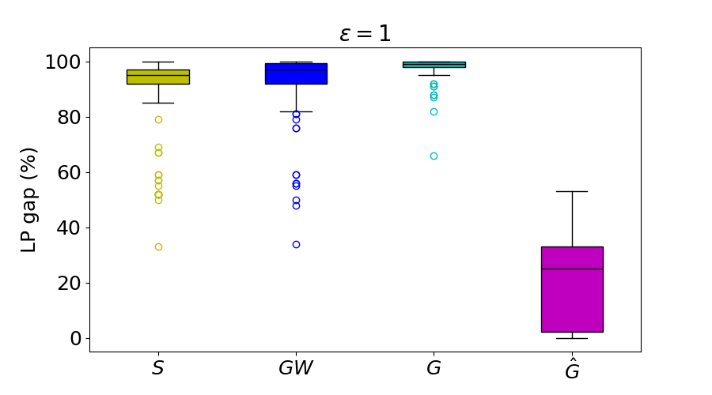
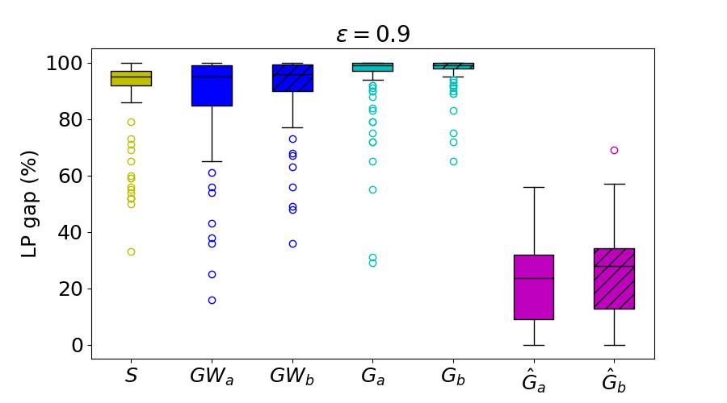
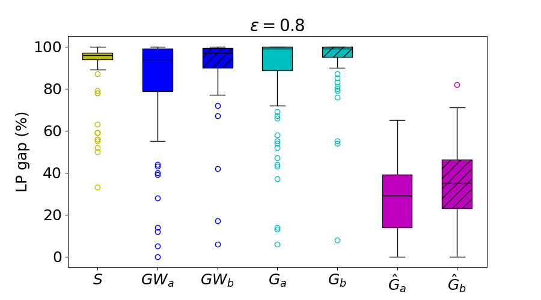

# Train Single-Routing Selection Problem (TSRSP) — Results Repository

## 📊 Instance Statistics

Complete statistics for the **Rouen** and **Lille** railway networks are available in the Excel file [`Computational_Results.xlsx`](./Computational_Results.xlsx).

The file reports the following key statistics for each instance:

- Number of trains ($k$);
- Number of routes ($|\mathcal{V}|$);
- Number of compatibility edges ($|\mathcal{E}|$);
- Objective function values;
- Computational results for the tested formulations.

For the **Rouen** instances, all instances were solved to optimality. The complete list of optimal values for all Rouen instances is available in the spreadsheet associated with formulation $G$.

For the **Lille** instances, only three instances ($L_1$, $L_2$, and $L_3$) were solved to optimality. For all remaining instances, the file reports the **best known upper bound** obtained within the time limit of 300 seconds.
 

All results reported below — **CPU time distributions**, **performance profiles**, and **LP relaxation and optimality gap distributions** — refer to the instances derived from the **Rouen railway network**.  
These instances are grouped by compatibility graph density, with values $\varepsilon \in \{1,0.9,0.8\}$.

All experiments were run with a maximum solution time of **300 seconds** per instance.
 

## 🕒 CPU Time Results for TSRSP Formulations

### 📈 CPU Time Distributions

The following box plots show the distribution of CPU times, in seconds, for all tested formulations, grouped by edge density of the compatibility graph.

Each plot reports the median, the interquartile range, and the outliers. It also reports the number of instances solved to proven optimality, denoted by **#opt**, out of 100 instances for each group.

  
  
  

**Observations:**

- The best performance is obtained by formulations $\hat{G}$, $\hat{G}_a$, and $\hat{G}_b$, which show low CPU times and small variability.
- Formulation $G$ is also effective for $\varepsilon = 1$, while its performance decreases when the compatibility graph becomes sparser.
- Formulations $GW$, $Q$, and $S$ are less effective, with CPU times often close to the time limit of 300 seconds.
 

### 📊 Performance Profiles

Following [Dolan and Moré (2002)](https://link.springer.com/article/10.1007/s101070100263), the **performance profile** $\rho_f(\tau)$ of a formulation $f$ measures how close its solution times are to the best solution time obtained over all tested formulations.

Let $t_{i,f}$ be the solution time of formulation $f$ on instance $i$, and let $\mathcal{F}$ be the set of tested formulations. We define:

$$
r_{i,f} = \frac{t_{i,f}}{\min_{f' \in \mathcal{F}} t_{i,f'}}
\quad,\quad
\rho_f(\tau) =
\frac{|\{ i \in \mathcal{I} : r_{i,f} \leq \tau \}|}{|\mathcal{I}|}.
$$

The following plots show $\rho_f(\tau)$ for each formulation and for each value of the edge density.

  
  
  

**Observations:**

- Formulations $\hat{G}$, $\hat{G}_a$, and $\hat{G}_b$ dominate the other formulations for all values of $\tau$.
- Formulation $G$ is competitive on dense graphs, but its performance decreases on sparser graphs.
- Formulations $GW$, $Q$, and $S$ solve fewer instances within short computing times.
- The difference between **non-edge constraints** and **anti-neighborhood constraints** is limited in terms of CPU time.
 

## 📉 LP and Optimality Gap for TSRSP Formulations

The following figure reports the box plots of the **percentage LP relaxation gap**, denoted by **LP gap (%)**.  
The gap is computed as the percentage difference between the optimal value of the LP relaxation of a MILP formulation and the optimal value of the instance.

The results are grouped by edge density of the compatibility graph.

  
  
  

**Observations:**

- Formulations in the $\hat{G}$ family provide the strongest LP relaxations, with smaller median gaps for all density levels.
- The improvement is particularly clear for $\varepsilon = 1$, where the median LP gap is around 30%.
- For $\varepsilon = 0.9$ and $\varepsilon = 0.8$, the LP gap remains below 40% on average, although the variability increases.
- Formulations $S$, $GW$, and $G$ provide weaker LP relaxations, with gaps often close to 100%.
- Formulations with non-edge constraints, such as $\hat{G}_a$, $G_a$, and $GW_a$, generally give smaller LP gaps than the corresponding variants with anti-neighborhood constraints.
 

The following figure reports the box plots of the **percentage optimality gap**, denoted by **Opt gap (%)**.  
The gap is computed as the percentage difference between the best feasible solution found and the best lower bound obtained within the time limit.

The values are reported only for the instances that were not solved to proven optimality. This analysis complements the CPU time plots by showing the quality of the solutions when optimality is not reached.

  
  
  

**Observations:**

- Formulations in the $G$ family solve more instances to optimality and also provide smaller gaps on the unsolved instances.
- Formulations $S$, $GW$, and $Q$ produce more suboptimal solutions and, in general, larger optimality gaps.
- For $\varepsilon = 1$, most unsolved instances solved with $G$ have gaps below 40%, while the gaps of $GW$ and $Q$ often exceed 60%.
- Formulation $S$ shows the largest median gaps across the three density levels.
- When the edge density decreases, both $G_a$ and $G_b$ show larger upper quartiles, suggesting that sparser compatibility graphs are harder to solve to optimality.
- Formulation $G_a$ performs better than $G_b$, confirming the advantage of using **non-edge constraints** instead of **anti-neighborhood constraints**.
- The median and first quartile of $GW$, especially $GW_a$, decrease when the edge density decreases, due to the smaller number of edge variables in sparser instances.
 